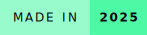
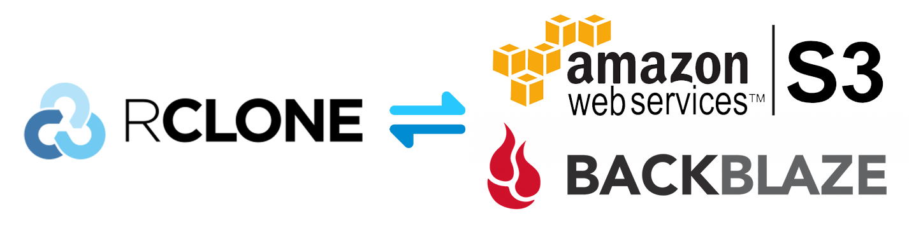
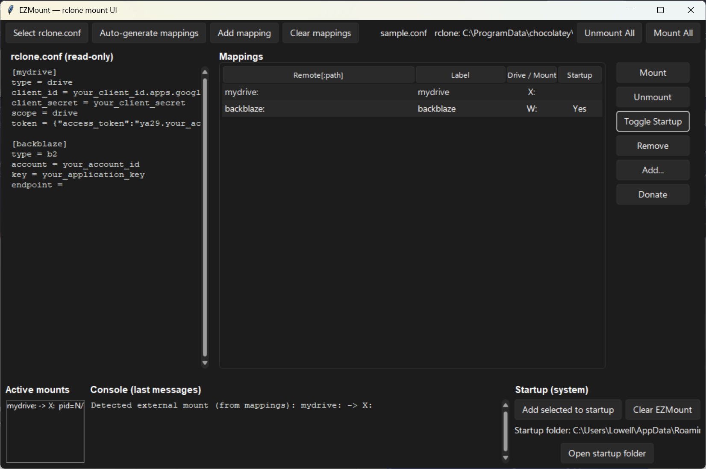
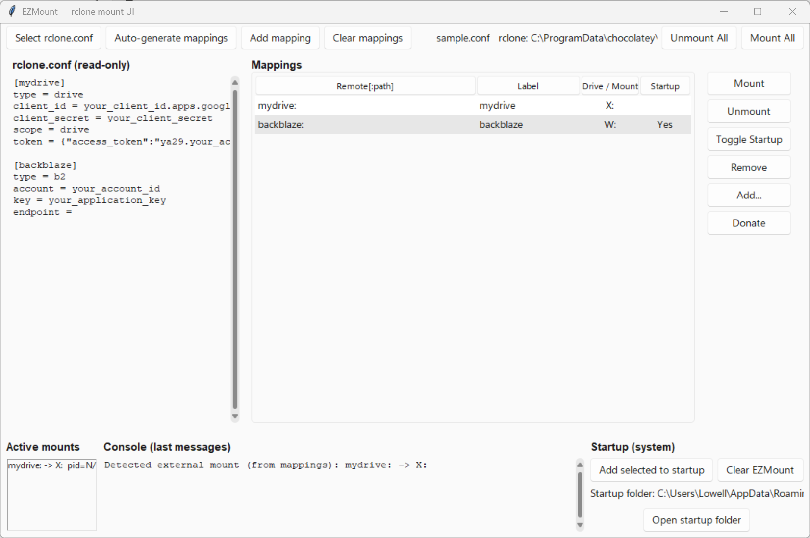
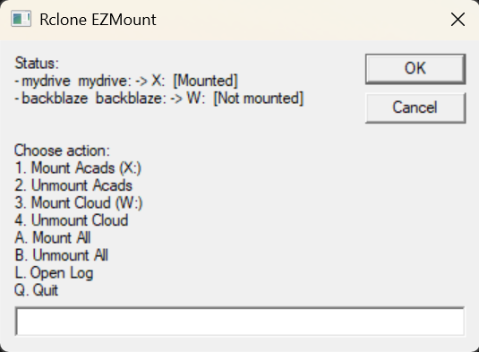

# EZMount

 

EZMount is a lightweight GUI utility (Tk/Ttk) designed to help you **manage RClone mounts** and **automate startup mounting** on Windows. It simplifies connecting cloud storage like AWS S3 or Backblaze B2 directly to your PC without dealing with command-line arguments.

### Author's Notes

This is my first personal project on **sysops/automation**. It started as a tool for easily mounting my AWS S3 buckets on my PC and grew into a simple open-source project.

---

## System Screenshots

  <h3>GUI - Dark Mode</h3>
  

  <h3>GUI - Light Mode</h3>
  

---

## Preparation

### Create an S3 Bucket

1. Log in to your **AWS Management Console**.
2. Navigate to **S3** → click **Create bucket**.
3. Give your bucket a **unique name** (must be globally unique).
4. Choose a **region** (closer to you = lower latency).
5. Leave most defaults, but ensure **Block Public Access** is enabled unless you specifically want public files.
6. After creating, go to **IAM → Users** to create an access key:
   - Assign programmatic access.
   - Attach `AmazonS3FullAccess` or a custom policy.
   - Save your **Access Key ID** and **Secret Access Key**.
7. These keys are what you’ll use in `rclone config`.

---

### Create a Backblaze B2 Bucket

1. Log in to your **Backblaze B2 account**.
2. Go to **Buckets** → click **Create a Bucket**.
3. Choose:
   - **Name** (unique within your account).
   - **Private** (recommended unless you want files publicly available).
4. Go to **App Keys** → **Add a New Application Key**.
   - Give it a name (e.g., `ezmount`).
   - Grant it **read/write access** to your bucket.
   - Copy the **Key ID** and **Application Key** (you won’t be able to view the secret again later).
5. Use these keys when configuring your remote in RClone.

---

_Note: This section provides a quick start. For advanced options (encryption, lifecycle rules, storage classes), refer to the official AWS or Backblaze documentation._

---

## How to Run

1. Install RClone and WinFSP (required for mounts). Recommended using Chocolatey or Winget: `choco install rclone winfsp`

2. Run `rclone config` and input your bucket access keys.

3. Run EZMount GUI:
   - Download the `.exe` from the release page (no Python required).
   - Or compile it yourself with Python: `pip install sv-ttk darkdetect` and then `python main.py`

- Point the GUI to your `rclone.conf` when prompted.

### Exception: Encrypted `.conf`

- The GUI does **not support encrypted `.conf` files**.
- Use `EZMount.vbs` (in the `vbs` folder) for encrypted configs.
  - It prompts for the password and opens a basic GUI.
  - Ensure `mounts.csv` is defined (follow the sample format). Avoid using preoccupied drive letters like `C:`.
  - For startup automation, use Task Scheduler or place the script in `shell:startup`.

  <h3>VBS UI</h3>
  

---

## FAQs

### 1. Do I need Python installed?

No, the prebuilt `.exe` works fine. Python is only needed if compiling from source or troubleshooting unexpected errors.

### 2. Does this automatically generate the RClone config?

No. You must create a `.conf` manually using `rclone config`. The GUI can read it but cannot create encrypted configs.

### 3. Do I need WinFSP installed?

Yes. Mounting cloud drives relies on WinFSP.

### 4. Does this support non-Windows OS?

The core idea works, but modifications are required. For example, `WinFSP` is Windows-specific, so Linux/macOS users need FUSE or alternatives, and the `.vbs` startup scripts won't work.

---

## LICENSE

This project is licensed under **AGPL 3.0**.
If you want to use it under a different license, contact me at `aquino.ylt@gmail.com`.

---

## Feedback

If you have any feedback/comment/request, please reach out to [aquino.ylt@gmail.com](mailto:aquino.ylt@gmail.com).

**Fuel future updates – buy me a coffee!**

### Thank you and God bless!
